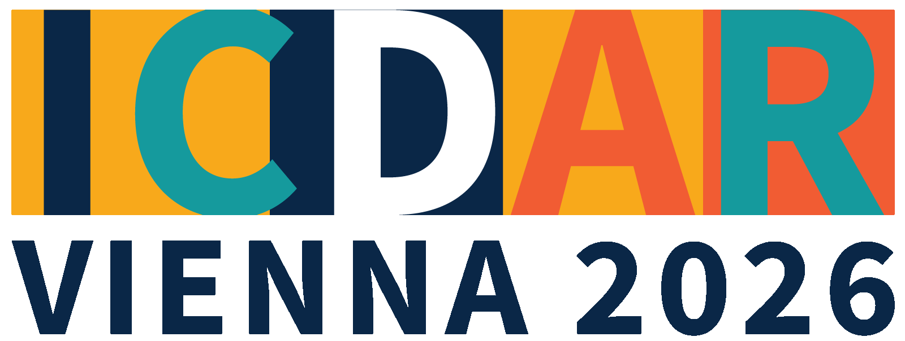

# MAS: A Millennium of Arabic Manuscripts in Three Styles

<p align="center">
  
</p>

**MAS (Medieval Arabic Script)** is a multi-domain line-level OCR benchmark for historical Arabic manuscripts spanning from the 10th to the 20th century. This repository contains the training and evaluation configurations accompanying our [ICDAR 2026 paper](https://link.springer.com/chapter/10.1007/978-3-032-36033-5_38).

The dataset is available on Hugging Face: [maximazzik/MAS](https://huggingface.co/datasets/maximazzik/MAS).

## 📖 Overview

The MAS dataset aims to bridge the gap in Arabic OCR by providing authentic historical benchmarks. While existing datasets often feature modern scribed text under controlled conditions, MAS provides:
- **11,841 annotated lines** from historical manuscripts.
- **Three major calligraphic styles**: Naskh, Taliq, and Nastaliq.
- **Multiple scholarly domains**: Astronomy, History, Mathematics, Religion, and Sufi Literature.
- **Millennium coverage**: Documents dating from the 10th to the 20th centuries.

Our research demonstrates that modern LVLMs have poor zero-shot performance on medieval scripts. After parameter-efficient fine-tuning, compact open-source LVLMs surpass the evaluated proprietary zero-shot models and approach strong specialized OCR baselines.

## 🔗 Resources

- **ICDAR 2026 paper:** [A Millennium of Arabic Manuscripts in Three Styles: A Line-Level OCR Benchmark for Naskh, Taliq, and Nastaliq](https://link.springer.com/chapter/10.1007/978-3-032-36033-5_38)
- **Dataset:** [MAS on Hugging Face](https://huggingface.co/datasets/maximazzik/MAS)
- **Dataset documentation:** [`docs/dataset.md`](docs/dataset.md)
- **Reproduction guide:** [`docs/reproduction.md`](docs/reproduction.md)
- **Reported results:** [`docs/results.md`](docs/results.md)

## 📂 Repository Structure

```text
.
├── assets/                 # Conference and documentation assets
├── configs/                # Training and evaluation configurations
│   ├── easy_ocr_...        # EasyOCR fine-tuning configs
│   ├── mmocr_...           # MMOCR ABINet configs
│   ├── paddle_...          # PaddleOCR Server/Mobile configs
│   ├── llamafactory/       # MAS registration and Qwen LoRA config
│   └── paper_arabic/       # lmms-eval task for MAS evaluation
│       ├── paper_arabic.yaml
│       └── utils.py
├── docs/
│   ├── dataset.md          # Dataset structure and metadata
│   ├── reproduction.md     # Training and evaluation workflow
│   └── results.md          # Main results from the paper
├── CITATION.cff            # Machine-readable citation
├── CONTRIBUTING.md         # Contribution guidelines
├── README.md               # Project documentation
└── .gitignore
```

## 🛠️ Supported Frameworks

This repository provides optimized configurations for:
- **EasyOCR**: Lightweight CRNN-based model.
- **PaddleOCR (PP-OCRv4/v5)**: Production-ready pipeline with Server and Mobile variants.
- **MMOCR**: Modular framework featuring the ABINet architecture.

## 🧪 Evaluation

Open-source LVLMs were evaluated with [`lmms-eval`](https://github.com/EvolvingLMMs-Lab/lmms-eval). Specialized OCR systems and closed-source models were scored from saved predictions using the same CER/WER definitions. The `lmms-eval` task is under `configs/paper_arabic/`. See [`docs/reproduction.md`](docs/reproduction.md) for the formulas and protocol.

### 🏃‍♂️ Running the Evaluation
To test different models on the dataset, run the following command:

```bash
python -m lmms_eval --model qwen2_5_vl --model_args pretrained=model_path --tasks paper_arabic --output_path results/test
```

## 🚀 Key Findings

Our experimental analysis reveals that:
1. **LVLMs are promising**: After fine-tuning, compact open-source LVLMs surpass the evaluated proprietary zero-shot models and approach strong specialized OCR baselines.
2. **Domain Specificity Matters**: Supervision on authentic medieval manuscripts is crucial. Training on modern or synthetic data alone only partially addresses the gaps caused by temporal and stylistic shifts.
3. **Generalization**: The inclusion of diverse calligraphic styles in MAS ensures better model robustness across different archival hands.

Selected numerical results and the transfer-learning analysis are available in [`docs/results.md`](docs/results.md).

## 📄 Citation

If you use the MAS dataset or these configurations in your research, please cite:

```bibtex
@inproceedings{novopoltsev2027mas,
  title={A Millennium of Arabic Manuscripts in Three Styles: A Line-Level OCR Benchmark for Naskh, Taliq, and Nastaliq},
  author={Novopoltsev, Maxim and Murtazin, Ruslan and Sakhovskiy, Andrey and Bojarskaja, Emilia and Kokh, Vladimir and Ulitin, Ivan and Abdullayev, Botirjon and Aminov, Khamidulla and Ismoilov, Masudkhon and Budennyy, Semen},
  booktitle={Document Analysis and Recognition -- ICDAR 2026},
  pages={643--659},
  year={2027},
  publisher={Springer Nature Switzerland},
  doi={10.1007/978-3-032-36033-5_38}
}
```

The same metadata is available in [`CITATION.cff`](CITATION.cff), enabling GitHub's **Cite this repository** action.

## Contributing

Please see [`CONTRIBUTING.md`](CONTRIBUTING.md) before submitting issues, configurations, or benchmark results.

---
*Official code and configurations for the MAS paper presented at ICDAR 2026.*
