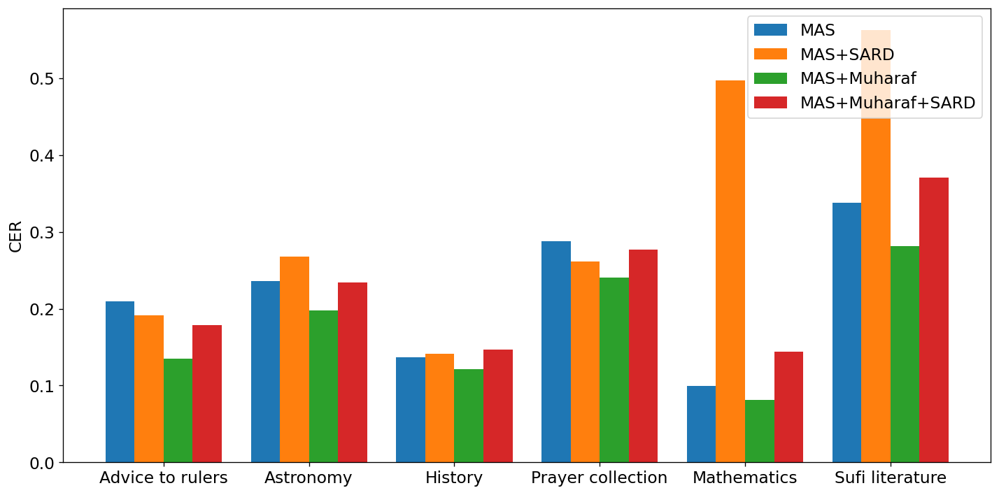

# Reported results

The values below are taken from the final paper and are measured on the 2,369-line MAS test split. Lower CER and WER are better; edit-distance error rates can exceed 1 when a model produces many insertions.

## Main findings

| Model | Training data | CER | WER |
|---|---|---:|---:|
| Qwen2.5-VL-3B | zero-shot | 4.282 | 3.90 |
| Qwen2.5-VL-3B | MAS | 0.229 | 0.555 |
| Qwen2.5-VL-3B | MAS + Muharaf | 0.191 | 0.495 |
| Qwen2.5-VL-3B | MAS + SARD | 0.312 | 0.702 |
| Qwen2.5-VL-3B | MAS + SARD + Muharaf | 0.236 | 0.592 |
| Qwen2.5-VL-3B | Muharaf only | 0.546 | 0.972 |
| Qwen2.5-VL-3B | SARD only | 5.10 | 4.41 |
| Qwen3-VL-4B | MAS | 0.223 | 0.543 |
| Qwen3-VL-4B | MAS + Muharaf | 0.217 | 0.509 |
| EasyOCR | MAS | 0.137 | 0.422 |
| EasyOCR | MAS + Muharaf | **0.122** | **0.391** |

The best evaluated LVLM, Qwen2.5-VL-3B trained on MAS and Muharaf, also achieved lower CER than the evaluated proprietary zero-shot models: Gemini 3 Flash Preview (0.275) and Claude 4.6 Sonnet (0.380). EasyOCR remained the strongest supervised task-specific baseline.

  

<em>Domain-wise CER for Qwen2.5-VL-3B. Adding Muharaf helps consistently; adding SARD raises error on mathematics and Sufi literature.</em>

## Script-wise transfer

| Model | Training data | Naskh CER/WER | Taliq CER/WER | Nastaliq CER/WER |
|---|---|---:|---:|---:|
| Qwen2.5-VL-3B | MAS | 0.276 / 0.672 | 0.269 / 0.570 | 0.183 / 0.505 |
| Qwen2.5-VL-3B | MAS + Muharaf | 0.224 / 0.597 | 0.224 / 0.513 | 0.156 / 0.447 |
| Qwen2.5-VL-3B | MAS + SARD | 0.251 / 0.653 | 0.297 / 0.659 | 0.344 / 0.749 |
| EasyOCR | MAS | 0.169 / 0.498 | 0.120 / 0.378 | 0.132 / 0.431 |
| EasyOCR | MAS + Muharaf | 0.173 / 0.500 | 0.107 / 0.348 | 0.115 / 0.386 |

These results support two qualified conclusions:

1. Authentic MAS supervision closes most of the zero-shot domain gap for compact LVLMs.
2. Later authentic handwriting provides a modest additional benefit, whereas synthetic SARD data does not consistently transfer and degrades Taliq and Nastaliq in this setup.

See the [paper](https://doi.org/10.1007/978-3-032-36033-5_38) for the complete experimental setup and analysis.
